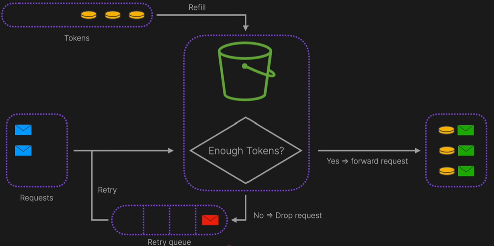
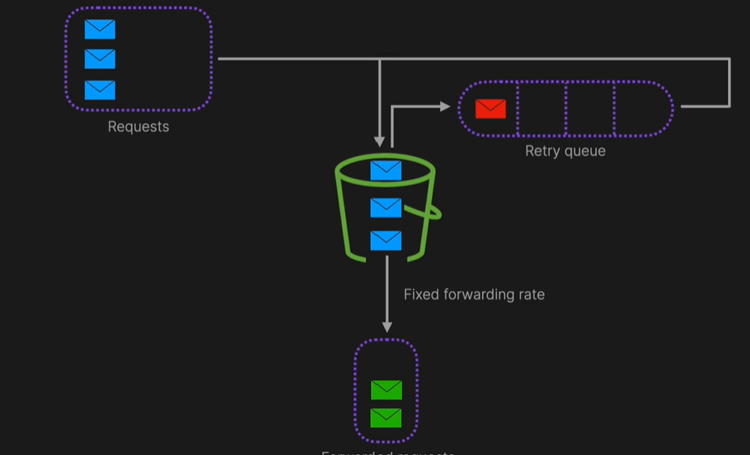
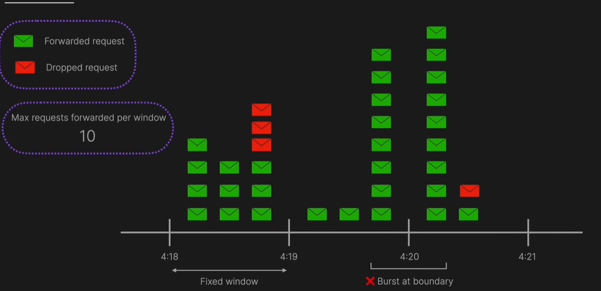

# Rate Limiting  

Rate limiting is a mechanism used to control the number of requests within a specified time frame so that applications or systems perform reliably and efficiently.  

---

## 🚀 Benefits  

1. Prevents system **overloading**  
2. Protects against **DDoS (Distributed Denial of Service)** attacks  
3. Helps in **cost management**  

---

## ⚙️ Where to Implement  

1. **Client Side**  
   - ✅ *Pros*: Immediate response to client, prevents server overload  
   - ❌ *Cons*: Easy to bypass (client can modify), inconsistent (different implementations per client/browser)  

2. **Server Side**  
   - ✅ *Pros*: Centralized and secure  
   - ❌ *Cons*: Server overhead, scalability challenges  

3. **Middleware**  
   - ✅ *Pros*: Offloads server, easily scalable  
   - ❌ *Cons*: Extra architectural complexity  

> **Note:** In real-world systems, API gateways (e.g., **AWS API Gateway**) are often used as middleware to enforce rate limiting.  
> When overloaded, return **HTTP 429 - Too Many Requests** to the client.  

---

## 🧮 Algorithms  

### 1. Token Bucket  
- A bucket holds tokens at a fixed rate (e.g., per second).  
- Each request consumes one token.  
- If the bucket is empty, requests are discarded.  

**Illustration:**  
  

---

### 2. Leaky Bucket  
- A bucket has a fixed size.  
- Requests are processed at a steady leak rate.  
- Excess requests overflow and are discarded.  

**Example:**  
- Bucket size = `10`  
- Leak rate = `5 req/sec`  

**Illustration:**  
  

---

### 3. Fixed Window  
- Defines a **time interval** and a maximum number of allowed requests.  

**Example:**  
- Interval = `1 min`  
- Allowed requests = `10`  

**Illustration:**  
  

---

### 4. Sliding Window  

Two main approaches:  

#### a) Sliding Window Log  
- Maintain a log/timestamp of each request.  
- Remove requests outside the current window.  
- If requests < limit → allow; else → reject.  

#### b) Sliding Window Counter  
- Maintain counts for the **previous** and **current** windows.  
- Weighted sum determines whether to allow or reject.  

#### Reference
 [blog post][algomaster] &
 [YouTube video][yt-video].

[algomaster]: https://blog.algomaster.io/p/rate-limiting-algorithms-explained-with-code
[yt-video]: https://www.youtube.com/watch?v=dpEOhfEEoyw&t=1s

---
